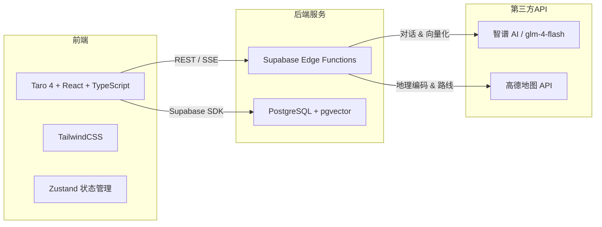

# 法律助手小程序（LegalAssistant）

面向大学生的法律咨询微信小程序，提供智能法律问答、合同审查、维权导航、案例广场等一站式法律服务。

## 核心功能

| 功能 | 说明 |
|------|------|
| **AI 法律咨询** | 基于 RAG（检索增强生成）的法律问答，信源回溯、多轮上下文确认、防幻觉 |
| **合同审查** | 上传合同图片，AI 识别霸王条款、评估风险等级、给出修改建议 |
| **维权导航** | 查询全国各地维权机构（劳动仲裁委、消协、法援中心），支持附近搜索和一键导航 |
| **案例广场** | 用户分享维权案例，支持点赞、收藏、分类筛选 |
| **法律工具** | 诉讼费计算器、证据清单生成等实用工具 |

## 技术架构



**技术栈：**

- **前端框架**：Taro 4 + React 18 + TypeScript 5
- **样式方案**：TailwindCSS 3 + Sass
- **状态管理**：Zustand 5
- **后端服务**：Supabase（PostgreSQL + pgvector 向量数据库 + Edge Functions）
- **AI 模型**：智谱 AI（glm-4-flash 用于对话，embedding-3 用于文本向量化）
- **地图服务**：高德地图 API（地理编码、路线规划、地点搜索）
- **构建工具**：Vite 4 + Webpack（通过 Taro CLI）
- **包管理器**：pnpm

## 页面清单

| 路由 | 页面 | 说明 |
|------|------|------|
| `pages/home/index` | 首页 | 功能入口、热点问题展示 |
| `pages/consult/index` | 法律咨询 | AI 对话式法律问答（含 RAG） |
| `pages/contract/index` | 合同审查 | 拍照上传合同，AI 审查风险 |
| `pages/plaza/index` | 案例广场 | 浏览/发布维权经验帖 |
| `pages/plaza/post` | 发布帖子 | 案例分享编辑页 |
| `pages/plaza/detail` | 帖子详情 | 案例详情查看 |
| `pages/tools/index` | 法律工具 | 实用法律工具入口 |
| `pages/document/index` | 法条检索 | 法律知识库检索 |
| `pages/calculator/index` | 诉讼费计算 | 诉讼费用计算器 |
| `pages/rights/index` | 维权导航 | 查找附近/各地维权机构 |
| `pages/evidence/index` | 证据清单 | 证据材料清单生成 |
| `pages/admin/index` | 知识库管理 | RAG 知识库后台管理 |
| `pages/login/index` | 登录页 | 微信一键登录 |
| `pages/profile/index` | 个人中心 | 用户信息与统计 |
| `pages/profile/history` | 咨询历史 | 历史对话记录 |
| `pages/profile/saved` | 收藏法条 | 已收藏的法律条文 |

## Edge Functions

| 函数 | 功能 | 调用方式 |
|------|------|----------|
| `legal-chat` | AI 法律咨询对话（含 RAG 检索增强），支持 SSE 流式和非流式双模式 | POST |
| `embed-document` | 文档文本向量化（调用智谱 embedding-3，1024 维） | POST |
| `contract-review` | 合同图片审查，识别霸王条款并给出风险建议 | POST |
| `ai-search` | 联网 AI 搜索，获取实时法律法规信息 | POST |
| `geocoding` | 地址 → 经纬度坐标转换 | POST |
| `reverse-geocoding` | 经纬度 → 省市区地址解析 | POST |
| `route-direction` | 路线规划（驾车/步行/公交） | POST |
| `route-matrix` | 批量距离矩阵计算（步行距离） | POST |
| `place-search` | 地点搜索（附近搜索 / 区域搜索） | GET |
| `ip-location` | IP 定位，获取用户当前城市 | GET |
| `wechat_miniapp_login` | 微信小程序登录，获取 OpenID 和 Session | POST |

## 快速开始

```bash
# 克隆仓库
git clone <repo-url>
cd <repo>

# 安装依赖
pnpm install

# 配置环境变量（复制模板并填写）
cp .env.example .env

# 微信小程序开发模式
pnpm dev:weapp

# 微信小程序构建
pnpm build:weapp
```

## 环境变量

创建 `.env` 文件（参考 `.env.example`）：

| 变量 | 说明 | 必填 |
|------|------|------|
| `TARO_APP_SUPABASE_URL` | Supabase 项目 URL | 是 |
| `TARO_APP_SUPABASE_ANON_KEY` | Supabase 匿名密钥 | 是 |
| `TARO_APP_APP_ID` | 微信小程序 AppID | 是 |

以下密钥在 **Supabase Dashboard → Edge Functions Secrets** 中配置，不在前端代码中：

| Secret | 说明 |
|--------|------|
| `INTEGRATIONS_API_KEY` | 智谱 AI API Key |
| `AMAP_KEY` | 高德地图 Web服务 API Key |

## 数据库表

### 核心业务表

| 表名 | 说明 | 关键字段 |
|------|------|----------|
| `rights_centers` | 维权机构数据（2560+ 条） | province, city, name, type, address, phone |
| `contract_reviews` | 合同审查记录 | file_url, file_name, review_result (JSONB) |
| `legal_knowledge` | RAG 知识库 | title, source, category, content, embedding (1024维) |
| `profiles` | 用户信息 | nickname, avatar_url, openid |
| `consult_history` | 咨询历史 | user_id, question, answer, rag_used |
| `case_posts` | 案例广场帖子 | user_id, category, title, content, likes_count |
| `case_likes` | 帖子点赞 | post_id, user_id |
| `case_saves` | 帖子收藏 | post_id, user_id |
| `saved_laws` | 收藏法条 | user_id, knowledge_id |
| `question_stats` | 热点问题统计 | question_text, category, week_number, year, count |

### 存储桶

| 桶名 | 用途 | 限制 |
|------|------|------|
| `contracts` | 合同图片上传 | 10MB, image/jpeg-png-gif-webp, application/pdf |

## 目录结构

```
├── README.md
├── package.json
├── pnpm-lock.yaml
├── tsconfig.json
├── tailwind.config.js
├── babel.config.js
├── postcss.config.js
├── project.config.json          # 微信小程序项目配置
├── .env.example                 # 环境变量模板
├── config/
│   ├── index.ts                 # Taro 构建配置
│   ├── dev.ts                   # 开发环境配置
│   └── prod.ts                  # 生产环境配置
├── src/
│   ├── app.config.ts            # Taro 应用配置（路由、TabBar）
│   ├── app.tsx                  # 应用入口
│   ├── app.scss                 # 全局样式
│   ├── index.html               # H5 入口 HTML
│   ├── client/
│   │   └── supabase.ts          # Supabase 客户端（customFetch 适配微信环境）
│   ├── components/
│   │   └── RouteGuard.tsx        # 登录路由守卫
│   ├── contexts/
│   │   └── AuthContext.tsx        # 用户认证上下文
│   ├── db/
│   │   ├── api.ts               # 数据库操作 API（Supabase 查询封装）
│   │   ├── types.ts             # 数据库类型定义
│   │   └── README.md
│   ├── hooks/
│   │   └── useTabBarPageClass.ts
│   ├── pages/                   # 页面组件（每个目录对应一个路由）
│   │   ├── home/                # 首页
│   │   ├── consult/             # 法律咨询
│   │   ├── contract/            # 合同审查
│   │   ├── plaza/               # 案例广场
│   │   ├── tools/               # 法律工具
│   │   ├── document/            # 法条检索
│   │   ├── calculator/          # 诉讼费计算器
│   │   ├── rights/              # 维权导航
│   │   ├── evidence/            # 证据清单
│   │   ├── admin/               # 知识库管理
│   │   ├── login/               # 登录
│   │   └── profile/             # 个人中心
│   ├── store/                   # Zustand 全局状态
│   ├── styles/
│   │   └── overrides.scss
│   ├── types/
│   │   └── global.d.ts
│   └── utils/
│       ├── callEdgeFunction.ts  # Edge Function 调用工具（绕过 supabase.functions.invoke 兼容问题）
│       └── upload.ts            # 文件上传工具
└── supabase/
    ├── config.toml              # Supabase CLI 配置
    ├── functions/               # Edge Functions（Deno）
    │   ├── _shared/cors.ts      # CORS 公共头
    │   ├── ai-search/
    │   ├── contract-review/
    │   ├── embed-document/
    │   ├── geocoding/
    │   ├── ip-location/
    │   ├── legal-chat/
    │   ├── place-search/
    │   ├── reverse-geocoding/
    │   ├── route-direction/
    │   ├── route-matrix/
    │   └── wechat_miniapp_login/
    └── migrations/              # 数据库迁移 SQL
        ├── 00001_init_legal_assistant.sql
        ├── 00002_add_legal_knowledge_rag.sql
        ├── 00003_change_embedding_vector_1536_to_1024.sql
        ├── 00004_add_plaza_and_hot_questions.sql
        └── 00005_add_login_and_profile.sql
```

## 部署

### Supabase 数据库

1. 在 [Supabase Dashboard](https://supabase.com/dashboard) 创建项目
2. 在 SQL Editor 中依次执行 `supabase/migrations/` 中的迁移文件
3. 在 `Database → Extensions` 中启用 `pgvector` 扩展

### Edge Functions 部署

```bash
# 安装 Supabase CLI
npm install -g supabase

# 登录
supabase login

# 关联项目
supabase link --project-ref isaoxdrzcyjisfodssfw

# 部署单个函数
supabase functions deploy legal-chat

# 部署全部函数
supabase functions deploy

# 配置 Secrets
supabase secrets set INTEGRATIONS_API_KEY=your-zhipuai-key
supabase secrets set AMAP_KEY=your-amap-key
```

### 微信小程序发布

1. 运行 `pnpm build:weapp` 构建
2. 打开微信开发者工具，导入 `dist/` 目录
3. 点击"上传"提交代码审核
4. 在微信公众平台提交审核并发布

## License

MIT
