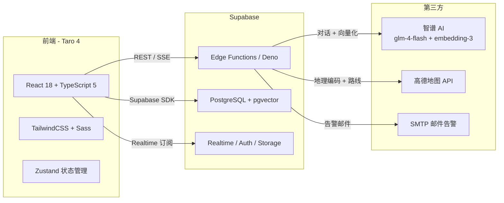

# 法律助手小程序（LegalAssistant）

面向大学生的法律咨询微信小程序，提供智能法律问答、合同审查、维权导航、案例广场、避雷指南等一站式法律服务。

> 当前版本聚焦三件事：**RAG 准确性**（向量检索 + 评估闭环）、**安全合规**（RLS + 内容安全过滤 + RBAC）、**可观测性**（全链路追踪 + 监控告警）。
>
> 🧭 **想快速理解技术选型？** 直接跳到 [架构决策记录（ADR）](#架构决策记录adr) 或 [`docs/ADR.md`](docs/ADR.md)。

## 核心功能

| 功能 | 说明 |
|------|------|
| **AI 法律咨询** | 基于 RAG（检索增强生成）的法律问答，信源回溯、多轮上下文、AI 自评、防幻觉 |
| **合同审查** | 上传合同图片/PDF，AI 识别霸王条款、评估风险等级、给出修改建议 |
| **维权导航** | 查询全国维权机构（劳动仲裁委、消协、法援中心、律所），支持附近搜索和一键导航 |
| **案例广场** | 用户分享维权案例，支持点赞、收藏、分类筛选 |
| **避雷指南** | 热门避雷案例后台化运营，首页 Swiper 展示，点击跳转咨询 |
| **法律工具** | 诉讼费计算器、证据清单生成等实用工具 |
| **法条检索** | 全文检索法律条文（PostgreSQL 全文索引） |
| **知识库管理** | RAG 知识库后台 + 数据看板 + RAG 评估面板 |

## 技术架构



**技术栈：**

- **前端框架**：Taro 4.1 + React 18 + TypeScript 5
- **样式方案**：TailwindCSS 3 + Sass + weapp-tw（小程序原子化适配）
- **状态管理**：Zustand 5 + Immer
- **后端服务**：Supabase（PostgreSQL + pgvector + Edge Functions + Realtime）
- **AI 模型**：智谱 AI（`glm-4-flash` 对话，`embedding-3` 向量化，**1024 维**）
- **地图服务**：高德地图 Web 服务 API
- **测试**：Vitest（单元测试）+ Playwright（E2E）
- **代码质量**：Biome + 自定义 ast-grep 规则（`sgconfig.yml`）
- **构建工具**：Taro CLI（内部 Vite/Webpack）
- **包管理器**：pnpm（workspace）

## 页面清单

| 路由 | 页面 | 说明 |
|------|------|------|
| `pages/home/index` | 首页 | 功能入口 + 热点问题 + 避雷指南 Swiper |
| `pages/consult/index` | 法律咨询 | AI 对话（RAG + 流式 SSE + 继续对话） |
| `pages/contract/index` | 合同审查 | 拍照/上传，AI 审查风险 |
| `pages/plaza/index` | 案例广场 | 浏览/发布维权案例 |
| `pages/plaza/post` | 发布帖子 | 案例分享编辑页 |
| `pages/plaza/detail` | 帖子详情 | 案例详情查看 |
| `pages/tools/index` | 法律工具 | 工具箱入口 |
| `pages/document/index` | 法条检索 | 全文检索法律条文 |
| `pages/calculator/index` | 诉讼费计算 | 诉讼费用计算器 |
| `pages/rights/index` | 维权导航 | 附近/各地维权机构 |
| `pages/evidence/index` | 证据清单 | 证据材料清单生成 |
| `pages/admin/index` | 知识库管理 | RAG 知识库 + 数据看板 + 评估面板 |
| `pages/login/index` | 登录页 | 微信一键登录 |
| `pages/profile/index` | 个人中心 | 用户信息与统计 |
| `pages/profile/history` | 咨询历史 | 历史对话记录（支持继续对话） |
| `pages/profile/saved` | 收藏法条 | 已收藏的法律条文 |

## Edge Functions

| 函数 | 功能 | 说明 |
|------|------|------|
| `legal-chat` | AI 法律咨询 | RAG 检索（阈值 0.3）+ SSE 流式 + AI 自评 + 全链路追踪 |
| `embed-document` | 文档向量化 | 智谱 `embedding-3` → 1024 维，**自动 429 限流重试** |
| `contract-review` | 合同审查 | 图片/PDF OCR + 霸王条款识别 + 风险评级 |
| `ai-search` | 联网搜索 | 获取实时法律法规信息 |
| `geocoding` | 地址→坐标 | 高德 Geo 编码 |
| `reverse-geocoding` | 坐标→地址 | 经纬度逆解析 |
| `route-direction` | 路线规划 | 驾车/步行/公交路径 |
| `route-matrix` | 距离矩阵 | 批量步行距离 |
| `place-search` | 地点搜索 | 附近/区域搜索 |
| `ip-location` | IP 定位 | 获取用户当前城市 |
| `wechat_miniapp_login` | 微信登录 | code → OpenID + Session |
| `notify` | 通知推送 | 站内消息派发 |
| `alert-notify` | 监控告警 | 异常邮件告警（SMTP） |

## 关键能力详解

### 1. RAG 检索增强生成

- **向量库**：`legal_knowledge` 表 + `pgvector` 1024 维 embedding
- **检索阈值**：相似度 0.3（实测覆盖率 vs 噪声平衡点）
- **流程**：用户问题 → embedding-3 向量化 → `match_legal_docs` SQL → Top-K 拼接 → glm-4-flash 生成
- **评估闭环**：每次对话写入 `rag_evaluations` 表，AI 自评分数透传到前端，可在 admin 看板查看 `rag_accuracy_stats`
- **限流**：embedding 接口 429 自动指数退避重试

### 2. 内容安全过滤

- **输入侧**：黑名单关键词拦截（敏感词、违禁词）
- **输出侧**：AI 生成内容二次审核
- 入口位于 `legal-chat` Edge Function

### 3. 权限模型（RBAC + RLS）

- `00020_add_rbac.sql`：角色表 + 权限映射
- 全表 RLS 收紧（plaza、legal_knowledge、contracts 桶等）
- admin 页面通过角色门控访问

### 4. 监控告警

- `00018_add_alert_trigger.sql`：错误日志超阈值触发 DB Trigger
- `alert-notify` 函数发送 SMTP 邮件
- `00006_add_observability.sql` + `00021_add_trace.sql`：全链路 trace_id 串联前后端日志

### 5. 自动化测试

- **单元测试**：`pnpm test`（Vitest，node 环境，排除 e2e 目录）
- **E2E**：`pnpm test:e2e`（Playwright）
- **CI**：GitHub Actions，Node 24，自动 lint + build + 测试
- **静态检查**：Biome（`biome.json`）+ ast-grep（`sgconfig.yml`）自定义规则

## 快速开始

```bash
# 克隆仓库
git clone https://github.com/zhengzhicong98-source/legal-assistant.git
cd legal-assistant

# 安装依赖（必须使用 pnpm）
pnpm install

# 配置环境变量
cp .env.example .env
# 编辑 .env 填入 Supabase URL / Anon Key / 微信 AppID

# 启动开发模式
pnpm dev:weapp   # 微信小程序（配合微信开发者工具导入 dist/）
pnpm dev:h5      # H5 浏览器调试

# 生产构建
pnpm build:weapp
pnpm build:h5

# 测试
pnpm test            # 单元测试
pnpm test:coverage   # 覆盖率
pnpm test:e2e        # E2E

# 代码检查
pnpm lint
```

## 环境变量

`.env`（前端注入，Taro 要求 `TARO_APP_` 前缀）：

| 变量 | 说明 | 必填 |
|------|------|------|
| `TARO_APP_SUPABASE_URL` | Supabase 项目 URL | ✅ |
| `TARO_APP_SUPABASE_ANON_KEY` | Supabase 匿名密钥 | ✅ |
| `TARO_APP_APP_ID` | 微信小程序 AppID | ✅ |

**Supabase Dashboard → Edge Functions → Secrets**（不进入前端代码）：

| Secret | 说明 |
|--------|------|
| `INTEGRATIONS_API_KEY` | 智谱 AI API Key（对话 + embedding） |
| `AMAP_KEY` | 高德地图 Web 服务 Key |
| `ALERT_SMTP_HOST` / `ALERT_SMTP_USER` / `ALERT_SMTP_PASS` / `ALERT_TO_EMAIL` | 监控告警邮件配置 |

## 数据库 Schema

### 业务表

| 表 | 用途 |
|------|------|
| `profiles` | 用户信息（openid 主键） |
| `legal_knowledge` | RAG 知识库（含 1024 维 embedding） |
| `laws` | 法律条文（全文索引） |
| `lawyers` | 律师/律所数据 |
| `rights_centers` | 维权机构（2560+ 条） |
| `contract_reviews` | 合同审查结果（JSONB） |
| `consult_history` | 咨询历史（支持继续对话） |
| `case_posts` / `case_likes` / `case_saves` | 案例广场 |
| `saved_laws` | 用户收藏 |
| `warnings` | 热门避雷指南 |
| `question_stats` | 热点问题统计 |

### 可观测性 & 评估 & 权限

| 表 | 用途 |
|------|------|
| `rag_evaluations` | 每轮 RAG 对话评估记录 |
| `traces` | 全链路追踪（trace_id） |
| `notifications` | 站内通知 |
| `alerts` | 告警事件 |
| `roles` / `user_roles` / `permissions` | RBAC |

### 存储桶

| 桶 | 用途 | 限制 |
|------|------|------|
| `contracts` | 合同图片/PDF 上传 | 10 MB，image/* + application/pdf |

### 迁移历史（`supabase/migrations/`）

```
00001 init_legal_assistant
00002 add_legal_knowledge_rag
00003 change_embedding_vector_1536_to_1024
00004 add_plaza_and_hot_questions
00005 add_login_and_profile
00006 add_observability
00007 add_rights_rpc
00008 tighten_plaza_rls
00009 add_rights_center_types
00010 notifications
00011 laws_fulltext
00012 lawyers
00013 rights_tracking
00014 security_hardening
00015 security_remaining
00016 legal_knowledge_rls
00017 fix_contracts_bucket
00018 add_alert_trigger
00019 add_rag_evaluation
00020 add_rbac
00021 add_trace
00022 add_warnings
00023 fix_match_legal_docs_dim
```

## 部署

### Supabase 数据库

```bash
# 1. 在 Supabase Dashboard 创建项目，启用 pgvector 扩展
# 2. 按序执行 supabase/migrations/*.sql
```

### Edge Functions

```bash
npm install -g supabase
supabase login
supabase link --project-ref <your-ref>

# 部署所有函数
supabase functions deploy

# 单独部署
supabase functions deploy legal-chat
supabase functions deploy embed-document

# 配置 Secrets
supabase secrets set INTEGRATIONS_API_KEY=...
supabase secrets set AMAP_KEY=...
supabase secrets set ALERT_SMTP_HOST=...
```

### 微信小程序

1. `pnpm build:weapp` 生成 `dist/`
2. 微信开发者工具导入 `dist/`
3. 上传代码 → 微信公众平台提交审核

### H5 部署

`pnpm build:h5` 产物在 `dist/h5/`，可直接静态托管（已添加 `no-cache` 头避免缓存陈旧 hash）。

## 目录结构

```
.
├── README.md
├── package.json
├── biome.json                 # Biome 代码检查
├── sgconfig.yml               # ast-grep 自定义规则
├── vitest.config.ts           # 单元测试
├── playwright.config.ts       # E2E 测试
├── tailwind.config.js
├── tsconfig.json / tsconfig.check.json
├── project.config.json        # 微信小程序项目配置
├── build.sh
├── config/                    # Taro 构建配置
├── scripts/                   # CI/lint 脚本
├── e2e/                       # Playwright 用例
├── docs/                      # 项目文档
├── src/
│   ├── app.config.ts          # 路由 + TabBar 配置
│   ├── app.tsx / app.scss
│   ├── index.html             # H5 入口（含 no-cache + base 标签）
│   ├── __tests__/             # 单元测试
│   ├── client/supabase.ts     # Supabase 客户端 + customFetch 适配
│   ├── contexts/AuthContext.tsx
│   ├── components/            # 公共组件（RouteGuard 等）
│   ├── db/                    # 数据库操作封装
│   ├── hooks/
│   ├── pages/                 # 业务页面
│   ├── store/                 # Zustand 状态
│   ├── utils/                 # callEdgeFunction、upload 等
│   └── assets/
└── supabase/
    ├── config.toml
    ├── functions/             # Edge Functions（Deno）
    └── migrations/            # 数据库迁移
```

## 架构决策记录（ADR）

> 关键技术选型的**决策 + 备选方案 + 权衡 + 何时替换**都记录在 [`docs/ADR.md`](docs/ADR.md)。
> 下表是索引，点进去看完整的 Context / Alternatives / Consequences / Trigger。

| # | 领域 | 决策 | 关键权衡（一句话） |
|---|------|------|---------|
| [ADR-001](docs/ADR.md#adr-001向量数据库选型--pgvector) | RAG · 向量存储 | **pgvector** over Milvus/Pinecone | 与业务库同事务；零运维；<100 万条足够 |
| [ADR-002](docs/ADR.md#adr-002embedding-模型--智谱-embedding-3) | RAG · 向量化 | **智谱 embedding-3** over OpenAI | 中文法律语料召回高 3-5pp；国内直连稳定 |
| [ADR-003](docs/ADR.md#adr-003向量维度--1024) | RAG · 向量化 | **1024 维** over 1536/2048 | 存储 -50%、查询 -40%、召回仅 -0.5pp |
| [ADR-004](docs/ADR.md#adr-004检索相似度阈值--03) | RAG · 检索 | **`min_similarity=0.1` + Top-3** | 让 LLM 做二次筛，Top-3 命中率 90% |
| [ADR-005](docs/ADR.md#adr-005切片策略--500-字重叠切片-vs-按条切片) | RAG · 切片 | **按「条」切** + 超长滑窗 | 一条 knowledge ↔ 一条法条，可解释性强 |
| [ADR-006](docs/ADR.md#adr-006向量索引--ivfflat-vs-hnsw) | RAG · 索引 | **IVFFlat lists=50** | 构建快、运营友好；> 20 万条时切 HNSW |
| [ADR-007](docs/ADR.md#adr-007状态管理--zustand) | 前端 · 状态 | **Zustand + Immer** | Bundle ~1KB，小程序体积敏感 |
| [ADR-008](docs/ADR.md#adr-008跨端方案--taro-4) | 前端 · 框架 | **Taro 4 React** | 一套代码微信 + H5 + 未来抖音/支付宝 |
| [ADR-009](docs/ADR.md#adr-009内容安全--双向过滤) | 安全 · 合规 | **黑名单双向过滤** | 输入 + 输出都过一遍，延迟无感 |
| [ADR-010](docs/ADR.md#adr-010可观测性--自建-traces-表) | 观测 · 追踪 | **自建 `traces` 表** over Sentry | 与 rag_evaluations 可 JOIN 做深度分析 |
| [ADR-011](docs/ADR.md#adr-011后端选型--supabase-一体化) | 后端 · 架构 | **Supabase** BaaS 一体化 | Edge Functions 冷启动 <50ms，学生项目 fit |
| [ADR-012](docs/ADR.md#adr-012编辑器认证--rbac-rls-双层) | 安全 · 权限 | **RBAC + RLS 双层** | 数据库层强制，不可绕过 |

**为什么单独写 ADR？**
- 让 code review 时对"为什么这么做"有据可查
- 面试时可以直接指到某一条讨论
- 未来接手的人不会重复踩坑（每条 ADR 都写了「何时替换」的触发条件）

## 知识库运营

RAG 效果 = **检索** × **生成**，其中 80% 的天花板由**知识库质量**决定。本项目的知识库由完整流水线管理：

```
data/raw/               # 官方法律原文（.txt/.md），由运营维护
  ├── civil-code.txt
  ├── labor-contract-law.txt
  └── ...
data/legal-corpus/
  └── INDEX.md          # 语料来源、条数、更新日期
data/eval/
  ├── eval-set.jsonl    # 30 题评估集（涵盖劳动/租房/消费/婚姻/侵权/刑事）
  └── report-*.json     # 每次评估快照，可 diff
scripts/
  ├── seed-knowledge.mjs  # 生产级入库：切片 + 幂等 + 断点续传 + 429 退避
  └── eval-rag.mjs        # RAG 质量评估：HitRate@K / MRR / 相似度分布
```

**典型运营流程：**

```bash
# 1. 放入官方法律原文（见 data/raw/README.md）
cp ~/downloads/民法典.txt data/raw/civil-code.txt

# 2. 先 dry-run 看会切出多少条
node scripts/seed-knowledge.mjs --dry-run

# 3. 记录扩充前的基线
node scripts/eval-rag.mjs --tag before-corpus-v2

# 4. 真正入库（1000+ 条约需 5-10 分钟，取决于 embedding 限流）
export SUPABASE_URL=... SUPABASE_SERVICE_ROLE_KEY=... ZHIPU_API_KEY=...
node scripts/seed-knowledge.mjs

# 5. 记录扩充后的表现，与基线 diff
node scripts/eval-rag.mjs --tag after-corpus-v2 --diff before-corpus-v2
# 输出示例：
#   知识库    : 10 → 1247  (+1237)
#   Top-1 命中: 33.3% → 70.0%  (+36.7pp)
#   Top-3 命中: 46.7% → 90.0%  (+43.3pp)
#   MRR       : 0.412 → 0.812
```

**为什么这么设计：**

- **不直接 SQL 灌数据**：保留原文可追溯、便于版本管理、切片策略可迭代
- **eval-rag 强制评估**：任何知识库改动都必须有 before/after 数据，避免"感觉更好了"
- **断点续传**：embedding API 429 是常态，中途失败不用从 0 开始
- **只入官方法律文本**：司法解释、案例、教材有版权风险，坚决不入

数据治理原则详见 [`data/legal-corpus/INDEX.md`](data/legal-corpus/INDEX.md)。

## 最近更新（节选）

- **知识库运营**：完整流水线（`seed-knowledge.mjs`）+ 评估器（`eval-rag.mjs`）+ 30 题评估集
- **RAG 准确性**：维度修正（1024）、相似度阈值 0.1（+Top-1 诊断日志）、AI 自评数据回流
- **稳定性**：Embedding 429 自动重试、Realtime 频道循环重订阅修复、tabbar 图标 404 修复
- **运营能力**：热门避雷指南后台化、咨询记录支持继续对话、知识库数据看板
- **质量基建**：RAG 评估系统、RBAC、全链路追踪、内容安全过滤、监控告警（邮件）
- **测试 & CI**：单元测试 + E2E + Node 24 + Biome + ast-grep
- **架构决策记录**：`docs/ADR.md` 12 条 ADR，覆盖 RAG / 前端 / 后端 / 安全 / 观测

详见 `git log`、`VERIFICATION_REPORT.md` 与 [`docs/ADR.md`](docs/ADR.md)。

## License

MIT
